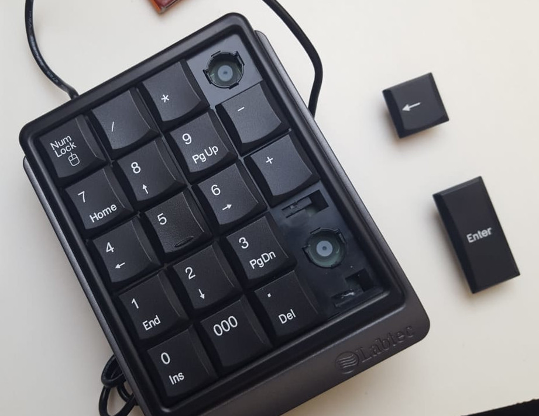
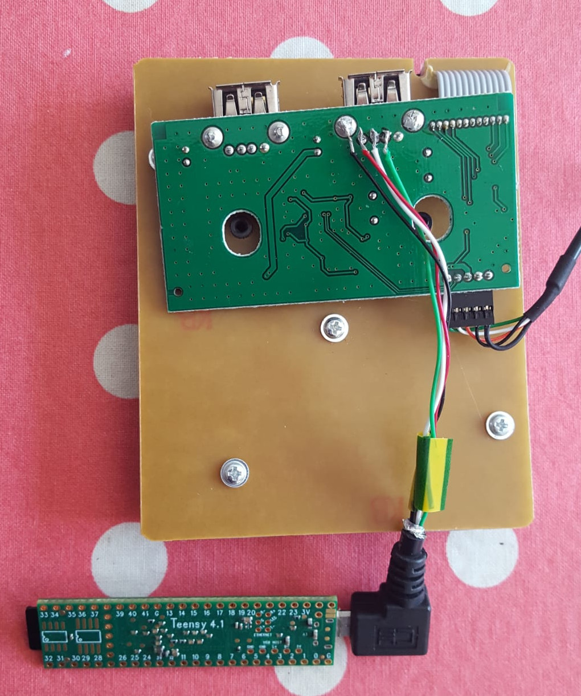
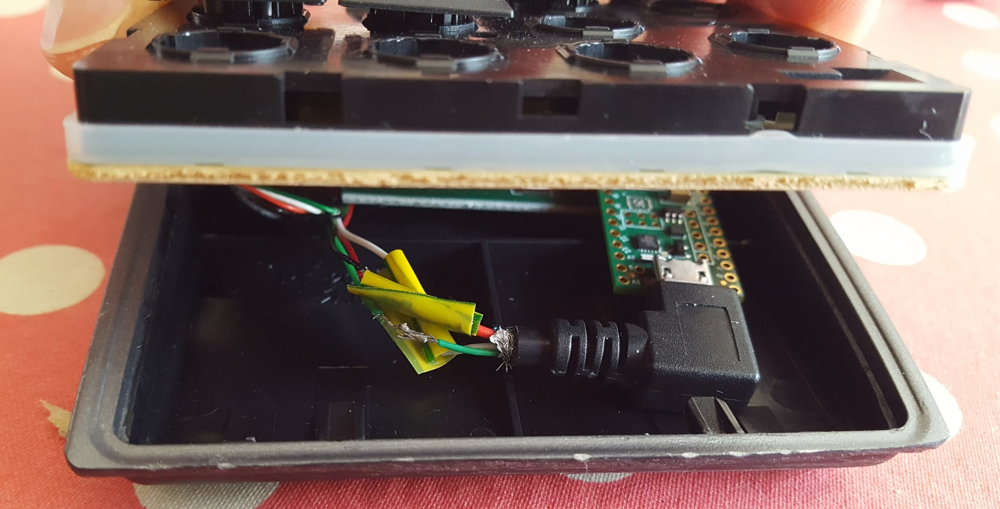
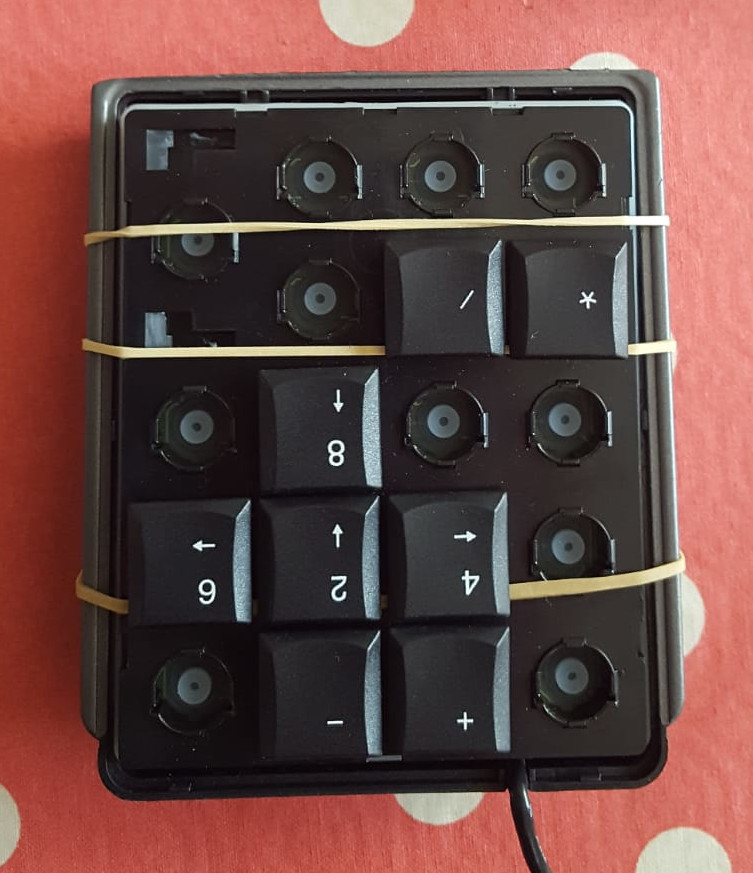
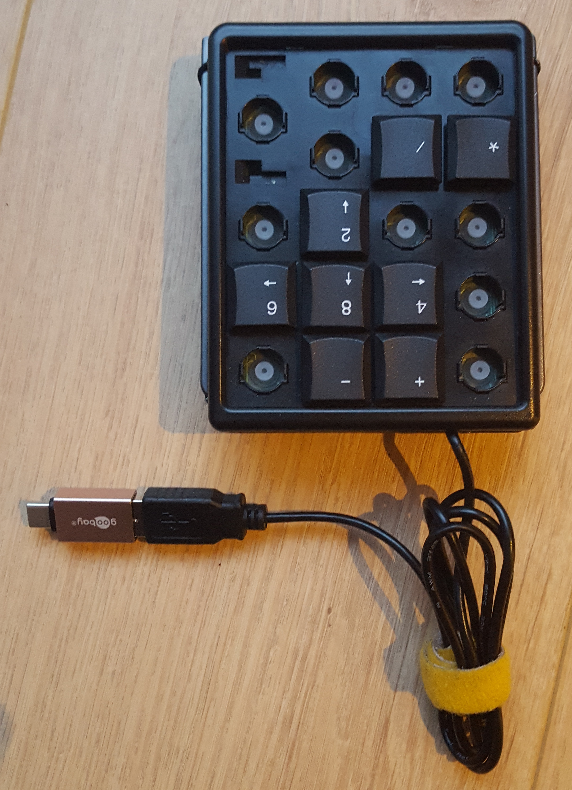

[Site officiel]

## Quand et pourquoi

Vers février 2025 j'ai cherché des [[Boites]] pouvant envoyer des séquences dont je pourrais contrôler le déroulement via [[MIDI]]. Un peu désorienté par le concept du M8, j'ai fini par comprendre.

## Ce que c'est

C'est un tracker, donc un logiciel de composition musical (voir [WP](https://fr.wikipedia.org/wiki/Tracker_(musique)) pour davantage de détails), ici implémenté dans un bel objet à seulement 8 boutons.

On y remplit des tableaux de nombres en écriture hexadécimale pour programmer les notes et les sons utilisés (samples ou synthés numériques).

## Prix et disponibilité

L'objet coûte 573€ sans les frais de douane mais le concepteur fabricant n'en produit que très peu. Il propose donc son logiciel en téléchargement gratuit pour que l'on puisse tester le concept, ce qui a donné lieu à des versions bidouille.

## Ma version bidouille en bref

Le cerveau du M8 est une Teensy 4.1, comme dans le vrai M8 (37€50), ici branchée à un câble micro-USB sacrifié pour soudage à un pavé numérique USB (2€ sur LBC). Coup de chance, ce numpad est aussi un concentrateur USB donc il n'y aura qu'un câble à brancher.

J'ai pu trouver des élastiques noirs qui ne se voient pas du dessus. Le seul truc peu pratique est l'accès à la micro SD.

## Le client

Il manque un écran pour voir et une carte son pour écouter! Je peux brancher ce montage:

- à un ordinateur disposant du navigateur Chrome (Firefox considère que la possibilité d'accéder aux ports USB est une faille de sécurité),
- à une console de retrogaming (ça fonctionne très bien c'est trop mignon),
- à un RPi, sur lequel je dois installer m8c (TODO).

## Notes perso

- Supprimer la sélection en continuant SHIFT+OPTION.